---
## Front matter
title: "Операционные системы"
subtitle: "Лабораторная работа №3"
author: "Хошхоев Александр Борисович"

## Generic otions
lang: ru-RU
toc-title: "Содержание"

## Bibliography
bibliography: bib/cite.bib
csl: pandoc/csl/gost-r-7-0-5-2008-numeric.csl

## Pdf output format
toc: true # Table of contents
toc-depth: 2
fontsize: 12pt
linestretch: 1.5
papersize: a4
documentclass: scrreprt
## I18n polyglossia
polyglossia-lang:
  name: russian
  options:
	- spelling=modern
	- babelshorthands=true
polyglossia-otherlangs:
  name: english
## I18n babel
babel-lang: russian
babel-otherlangs: english
## Fonts
mainfont: PT Serif
romanfont: PT Serif
sansfont: PT Sans
monofont: PT Mono
mainfontoptions: Ligatures=TeX
romanfontoptions: Ligatures=TeX
sansfontoptions: Ligatures=TeX,Scale=MatchLowercase
monofontoptions: Scale=MatchLowercase,Scale=0.9
## Biblatex
biblatex: true
biblio-style: "gost-numeric"
biblatexoptions:
  - parentracker=true
  - backend=biber
  - hyperref=auto
  - language=auto
  - autolang=other*
  - citestyle=gost-numeric
## Pandoc-crossref LaTeX customization
figureTitle: "Рис."
tableTitle: "Таблица"
listingTitle: "Листинг"
lofTitle: "Список иллюстраций"
lotTitle: "Список таблиц"
lolTitle: "Листинги"
## Misc options
indent: true
header-includes:
  - \usepackage{indentfirst}
  - \usepackage{float} # keep figures where there are in the text
  - \floatplacement{figure}{H} # keep figures where there are in the text
---

# Цель работы

– Изучить идеологию и применение средств контроля версий. 

– Освоить умения по работе с git.

# Ход работы

1. Создадим учетную версию на https://github.com и заполним основные данные.Примечание: я ранее регистрировался на данном сайте, поэтому не буду повторяться.

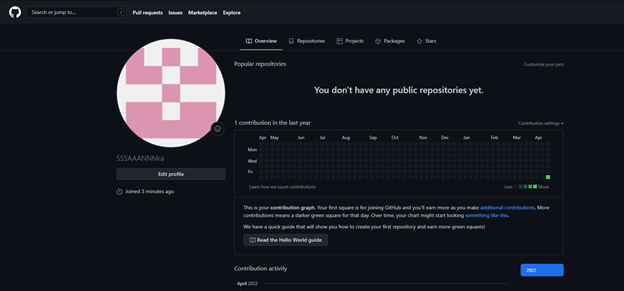{width=100% }
*Рис. 1: Создание учетной записи на Github*

2. Установим программное обеспечение git-flow через терминал (рис. 2).

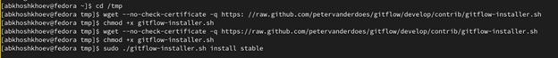{width=100% }

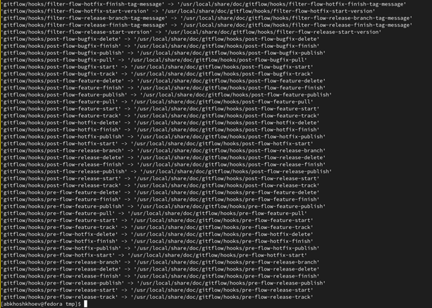{width=100% }
*Рис. 2: Установка git-flow на Linux Fedora*

3. Установим программное обеспечение gh через терминал (рис. 3).

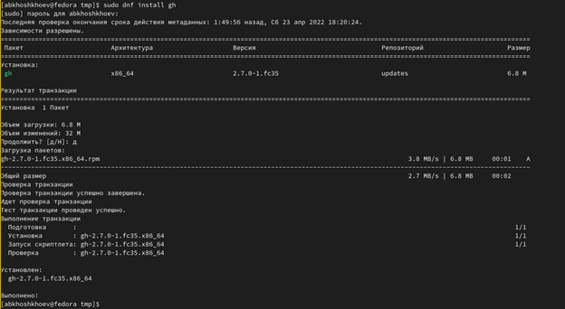{width=100% }

*Рис. 3: Установка gh на Linux Fedora*

4. Совершим базовую настройку git (рис. 4):

    1) Зададим имя и email владельца репозитория.
    2) Настроим utf-8 в выводе сообщений git.
    3) Настроим верификацию и подписание коммитов git. 
    4) Зададим имя начальной ветки (будем называть её master).
    5) Зададим параметр autocrlf и safecrlf.

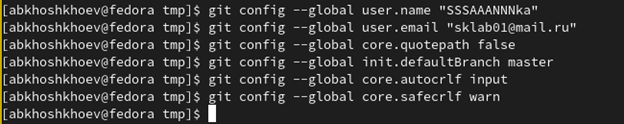{width=100% }
*Рис. 4: Базовая настройка git*

5. Создадим ключ SSH (рис. 5): 

      1) по алгоритму rsa с ключём размером 4096 бит.
      2) по алгоритму ed25519.

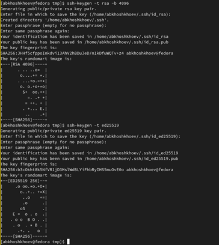{width=100% }

*Рис. 5: Создание ключа ssh*

6. Создадим ключ GPG (рис. 6.1 и 6.2). Выберем опции, описанные в лабораторной:
		
    – тип RSA and RSA. 
    
    – размер 4096;

    – выберите срок действия; значение по умолчанию — 0 
    
    – GPG запросит личную информацию, которая сохранится в ключе: 
    
    – Имя. 
    
    – Адрес электронной почты.

    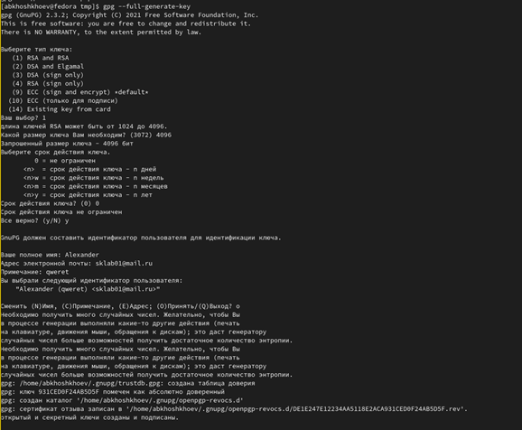{width=100% }
      
      *Рис. 6.1: Создание ключа gpg*
    
    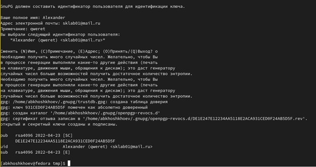{width=100% }
    
    *Рис. 6.2: Продолжение вывода*

7. Выводим список ключей и копируем отпечаток приватного ключа (рис. 7). Отпечаток ключа – 931CED0F24AB5D5F

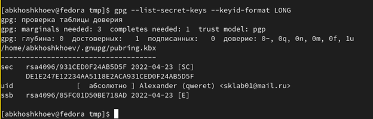{width=100% }

*Рис. 7: Вывод списка приватных ключей*

8. Скопируем наш сгенерированный GPG ключ в буфер обмена (рис. 8.1) и вставим его в настройках личнего кабинета Github (рис. 8.2).

{width=100% }

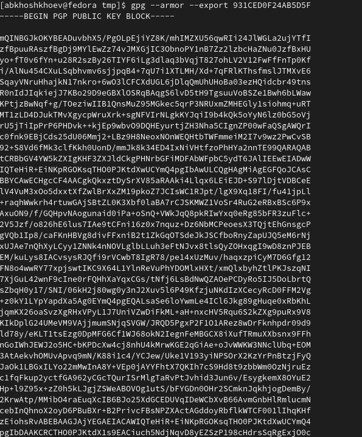{width=100% }

*Рис. 8.1: Копирования gpg ключа в буфер обмена*

9. Сгенерированный SSH ключ и скопируем его в буфер обмена (рис. 9) и вставим его в настройках личнего кабинета Github (рис. 8.2).

{width=100% }

*Рис. 9: Копирования ssh ключа в буфер обмена*

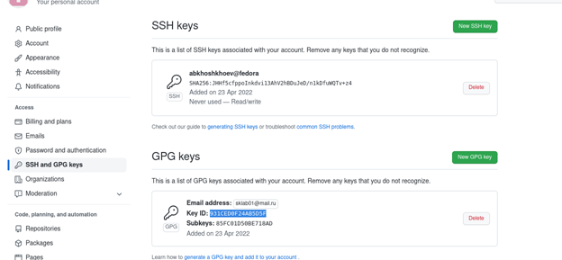{width=100% }

*Рис. 9.2: Заполнение ключей SSH и GPG в личном аккаунте*

10. Настроим автоматические подписи коммитов Git. Используя введенный email, укажем Git применять его при подписи коммитов (рис. 10).

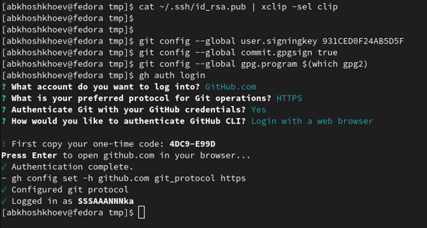{width=100% }

*Рис. 10: Настроение автоматических подписей коммитов Git*

11. Настроим gh. Для начала необходимо авторизоваться, можно через браузер (рис. 11).

{width=100% }

*Рис. 11: Настройка gh*

12. Создадим репозитория курса на основе шаблона. Для этого создадим каталоги work/study/2021-2022/”Операционные системы” (рис. 12)

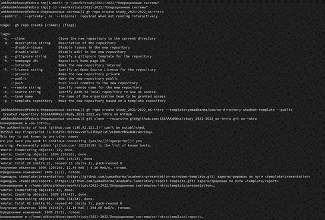{width=100% }

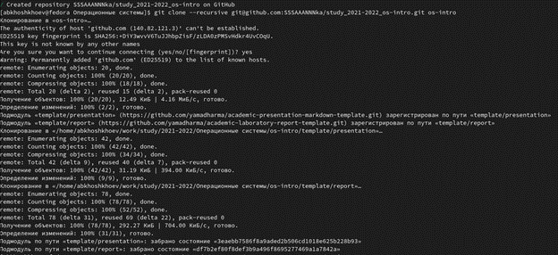{width=100% }

*Рис. 12: Создание репозитория курса*

13. Настроим каталог курса (рис. 13.1, 13.2 и 13.3). Для этого:
		
    1) Перейдем в каталог курса.
		
    2) Удалим лишние файлы.
		
    3) Создадим необходимые каталоги.
		
    4) Отправим файлы на сервер.

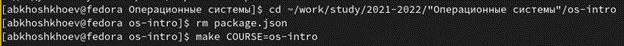{width=100% }

*Рис. 13.1: Переход в каталог, удаление лишних файлов и 
создание необходимых каталогов*

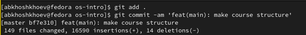{width=100% }

*Рис. 13.2: Отправка файлов на сервер*

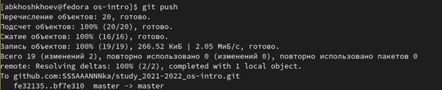{width=100% }

*Рис. 13.3: Продолжение вывода*

# Вывод

В ходе этой лабораторной работы мы изучили идеологию и применение средств контроля версий. Освоили умения по работе с git.

# Контрольные вопросы 

1.	Система управления версиями (также используется определение «система контроля версий [1]», от англ. Version Control System, VCS или Revision Control System) — программное обеспечение для облегчения работы с изменяющейся информацией. Система управления версиями позволяет хранить несколько версий одного и того же документа, при необходимости возвращаться к более ранним версиям, определять, кто и когда сделал то или иное изменение, и многое другое.

2.	Хранилище – то где хранится документ.
        Commit – изменение документа.
        История – история изменения документа.
        Рабочая копия – текущая версия документа.

3.

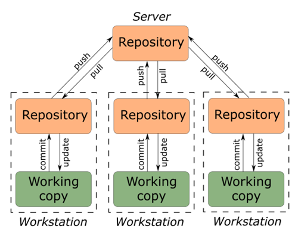{width=100% }

  
  *Централизованная*
  

 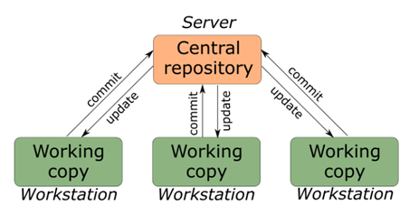{width=100% }

   *Децентрализованная*

4.	Изначально разработчик работает с веткой master. При реализации отдельных частей проекта может создать ветки для них. При завершении изменений разработчик коммитит и пушит изменения на сервер. Если разработка на сторонней ветке завершена, то её можно смерджить (merge), например с основной веткой master. 

